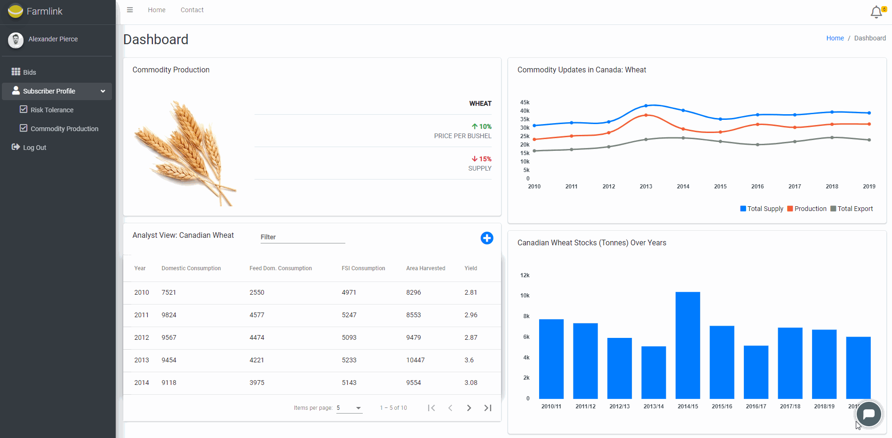
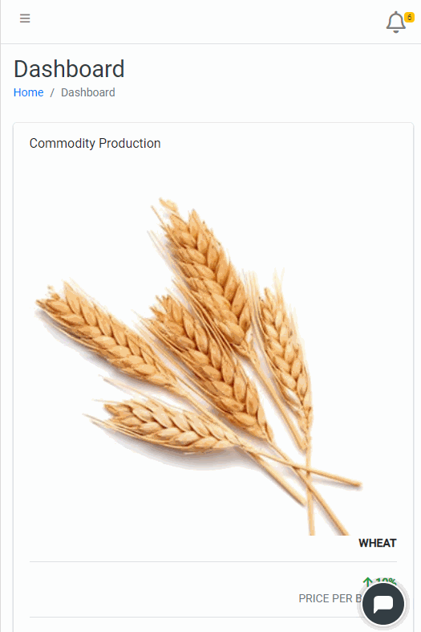
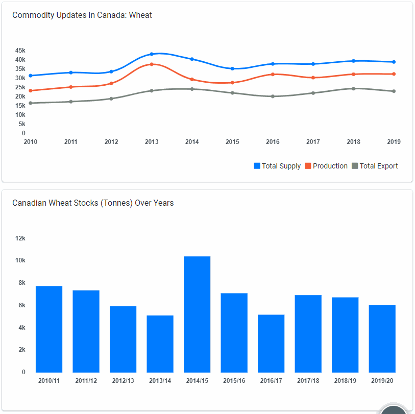
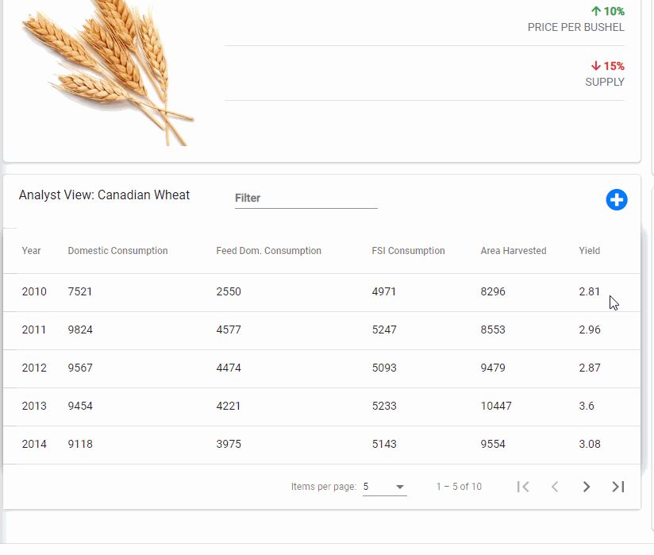
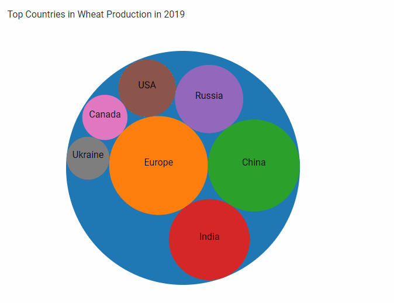
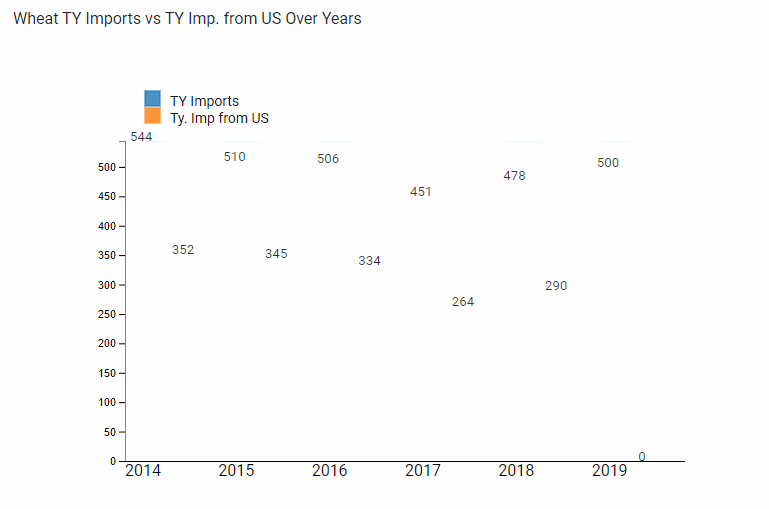
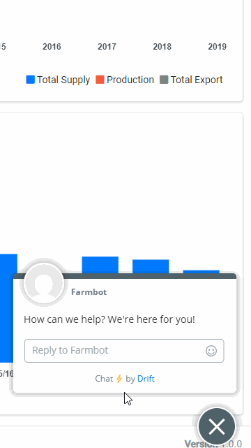

# WebDashboard
The purpose of this project is to gain insights into the agricultural market data of different commodities, e.g., Wheat, Corn, Barley, Oats etc. and present them in a dashboard. The data includes different attributes such as consumption, production, import, export, stocks, yield of the commodities. The data reports attributes on 125 countries and over 20 years timeline.

• This project is generated with [Angular CLI](https://github.com/angular/angular-cli) version 9.1.7.  
• The UI supports responsive layouts. 
• For developing the visualizations, PSD Grain Data_small.xlsx has been used.  
• For keeping the project simple, only "Wheat" from country "Canada" has been used for the calculations of the timeseries, barplot, crosstab, and pack layout graphs.  
• The visualizations have been developed using chart.js and d3.js.  
• The color palettes of the visualizations are carefully chosen to support color-blind users.  
• The calculations have been performed using Tableau. To see more details, please open Canadian_Wheat.twb file with Tableau Desktop.  
• For designing the Farmbot, [drift](https://www.drift.com/) is used.

# Desktop UI

# Mobile UI

## Interactive Tooltip

## Dynamic Table

## Incorporated Graphs (D3.js)

## Farmbot

## How to run
Please go to the project directory and run the following commands:

Install all the dependencies
> npm install package.json

Run the server
> npm start

## Development server

Run `ng serve` for a dev server. Navigate to `http://localhost:4200/`. The app will automatically reload if you change any of the source files.

## Code scaffolding

Run `ng generate component component-name` to generate a new component. You can also use `ng generate directive|pipe|service|class|guard|interface|enum|module`.

## Build

Run `ng build` to build the project. The build artifacts will be stored in the `dist/` directory. Use the `--prod` flag for a production build.

## Running unit tests

Run `ng test` to execute the unit tests via [Karma](https://karma-runner.github.io).

## Running end-to-end tests

Run `ng e2e` to execute the end-to-end tests via [Protractor](http://www.protractortest.org/).

## Further help

To get more help on the Angular CLI use `ng help` or go check out the [Angular CLI README](https://github.com/angular/angular-cli/blob/master/README.md).
